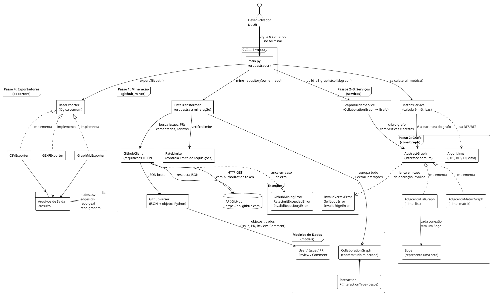

# Documentação do Projeto — Análise de Colaboração no GitHub

## O que esse projeto faz? (explicado como para uma criança)

Imagine que você tem uma turma de programadores que trabalham juntos num projeto no GitHub. Alguns comentam muito no código dos outros, alguns fazem revisões detalhadas, e alguns são os responsáveis por aprovar e juntar o trabalho de todo mundo.

Agora imagine que você quer saber: **quem é a pessoa mais importante dessa turma? Quem conecta todo mundo? Quem trabalha mais?**

Para responder isso, esse projeto:

1. **Vai até o GitHub e baixa tudo** — cada comentário, cada revisão de código, cada aprovação de PR
2. **Desenha um mapa de relacionamentos** — como se fosse um mapa de amizades, onde cada seta entre duas pessoas representa uma colaboração
3. **Calcula quem é mais importante** — usando 9 tipos diferentes de "pontuação matemática"
4. **Gera arquivos** que você pode abrir no Gephi (um programa gratuito) para ver o mapa visualmente com cores, tamanhos e setas

---

## É um site? Um servidor? Uma API?

**Não.** É uma **ferramenta de linha de comando (CLI)**.

Isso significa que você abre o terminal, digita um comando, e o programa roda, faz tudo, gera os arquivos e termina. Não tem:
- Servidor rodando em segundo plano
- Banco de dados
- Interface web
- API REST

É como um programa de calculadora: você entra com os dados, ele processa e te dá o resultado.

---

## Como usar

```bash
python -m codigos.app.main \
  --owner devlikeapro \
  --repo waha \
  --token SEU_TOKEN_GITHUB \
  --output ./resultados \
  --format csv,gexf,graphml \
  --verbose
```

| Argumento | O que significa |
|-----------|----------------|
| `--owner` | O dono do repositório no GitHub (ex: `devlikeapro`) |
| `--repo` | O nome do repositório (ex: `waha`) |
| `--token` | Sua chave de acesso ao GitHub (Personal Access Token) |
| `--output` | Onde salvar os arquivos gerados |
| `--format` | Em quais formatos exportar (csv, gexf, graphml) |
| `--verbose` | Mostrar mais detalhes durante a execução |

---

## O que é um "grafo"?

Pense num mapa de amizades da escola:

```
Alice -----> Bob        (Alice comentou no PR do Bob)
Bob -------> Charlie    (Bob fez review do código de Charlie)
Charlie ---> Alice      (Charlie aprovou e fez merge do PR da Alice)
```

Cada **pessoa** é um ponto chamado **vértice**.
Cada **seta** entre duas pessoas é chamada de **aresta**.
Cada seta tem um **peso** (um número) que indica o quanto forte foi aquela colaboração.

### Tabela de pesos das interações

| O que aconteceu | Peso | Por quê esse peso? |
|-----------------|------|-------------------|
| Fechar uma issue | 1 | É uma ação simples, sem muito esforço de colaboração |
| Comentar em issue ou PR | 2 | Participação leve, deu uma opinião |
| Aprovar um PR | 3 | Confiou no trabalho do outro e aprovou |
| Fazer review detalhado do código | 4 | Leu o código com atenção e deu feedback |
| Fazer merge de um PR | 5 | Decisão final — integrou o trabalho ao projeto |

**Quanto maior o peso, mais importante foi essa colaboração.**

Se Alice e Bob trocam muitos comentários, a seta entre eles vai ficando mais "grossa" (peso acumulado maior).

---

## O pipeline completo — o que acontece quando você roda o comando

```
VOCÊ DIGITA O COMANDO
         |
         v
╔════════════════════════════════════════════════════╗
║  PASSO 1: MINERAÇÃO DE DADOS                       ║
║                                                    ║
║  O programa vai até o GitHub e baixa:              ║
║  • Todas as issues do repositório                  ║
║  • Todos os Pull Requests                          ║
║  • Todos os comentários de issues                  ║
║  • Todos os comentários de PRs                     ║
║  • Todos os reviews de cada PR                     ║
║                                                    ║
║  Usa seu token para se autenticar                  ║
║  Trata paginação automaticamente                   ║
╚════════════════════════════════════════════════════╝
         |
         v
╔════════════════════════════════════════════════════╗
║  PASSO 2: CONSTRUÇÃO DO GRAFO                      ║
║                                                    ║
║  Percorre todos os dados baixados e para cada      ║
║  interação encontrada, cria uma seta:              ║
║                                                    ║
║  "Alice comentou no PR do Bob" → seta Alice→Bob    ║
║  "Bob fez review de Charlie"   → seta Bob→Charlie  ║
║                                                    ║
║  Gera 3 grafos diferentes:                         ║
║  • total         → todas as interações             ║
║  • issues        → só interações em issues         ║
║  • pull_requests → só PRs, reviews e merges        ║
╚════════════════════════════════════════════════════╝
         |
         v
╔════════════════════════════════════════════════════╗
║  PASSO 3: CÁLCULO DE MÉTRICAS                      ║
║                                                    ║
║  Para cada desenvolvedor, calcula 9 pontuações     ║
║  que medem diferentes tipos de importância         ║
║                                                    ║
║  Usa a biblioteca NetworkX para algoritmos         ║
║  matemáticos complexos                             ║
╚════════════════════════════════════════════════════╝
         |
         v
╔════════════════════════════════════════════════════╗
║  PASSO 4: EXPORTAÇÃO DOS RESULTADOS                ║
║                                                    ║
║  Salva os arquivos em disco:                       ║
║  • repo_nodes.csv  → lista de desenvolvedores      ║
║  • repo_edges.csv  → lista de conexões             ║
║  • repo.gexf       → formato para o Gephi          ║
║  • repo.graphml    → formato para Cytoscape/yEd    ║
╚════════════════════════════════════════════════════╝
         |
         v
VOCÊ ABRE OS ARQUIVOS NO GEPHI E VÊ O MAPA VISUAL
```

---

## As 9 métricas explicadas como para uma criança

### 1. Degree Centrality (Centralidade de Grau)
**Analogia:** Quantos amigos ela tem no total?

Mede a proporção de pessoas com quem esse desenvolvedor se conectou (enviou ou recebeu colaborações). Uma pessoa com muitas conexões tem degree centrality alto. Vai de 0 a 1.

### 2. In-Degree (Grau de Entrada)
**Analogia:** Quantas pessoas chegaram até ela?

Conta quantas setas chegam **nessa pessoa**. Alto in-degree significa que muitas pessoas colaboraram com ela — ela recebe muita atenção, revisão, comentários.

### 3. Out-Degree (Grau de Saída)
**Analogia:** Com quantas pessoas ela foi até lá?

Conta quantas setas **saem dessa pessoa**. Alto out-degree significa que ela vai muito até os outros — comenta muito, revisa muito, é ativa.

### 4. Betweenness Centrality (Centralidade de Intermediação)
**Analogia:** Ela é a "ponte" entre grupos diferentes?

Imagine dois grupos que quase não se falam. Se há uma única pessoa que conecta os dois grupos, ela tem betweenness alto. É o "conector" do time — sem ela, partes do time ficariam desconectadas.

### 5. Closeness Centrality (Centralidade de Proximidade)
**Analogia:** Ela consegue falar com todo mundo rapidamente?

Mede o quão perto essa pessoa está de todos os outros no grafo. Quem tem closeness alto consegue "alcançar" qualquer pessoa em poucos passos. É quem espalha informação mais rápido.

### 6. PageRank
**Analogia:** O algoritmo do Google aplicado ao time!

O Google usa esse algoritmo para saber quais sites são mais importantes. Aqui funciona igual: uma pessoa tem PageRank alto se as pessoas que colaboram com ela também são importantes. Não basta ter muitas conexões — precisa se conectar com pessoas relevantes.

### 7. Clustering Coefficient (Coeficiente de Agrupamento)
**Analogia:** O grupo de amigos dela está bem conectado entre si?

Se Alice trabalha com Bob e Charlie, e Bob e Charlie também trabalham entre si, Alice tem clustering alto. Mede o quão "fechado" é o círculo de colaboração ao redor de uma pessoa.

### 8. Eigenvector Centrality (Centralidade de Autovetor)
**Analogia:** Ela é importante porque se conecta com pessoas importantes?

Similar ao PageRank, mas mede importância recursiva. Não importa só quantas conexões você tem, mas quão importantes são as pessoas com quem você se conecta.

---

## Estrutura de arquivos do projeto

```
grafos/
│
├── codigos/                          ← Todo o código fonte
│   │
│   ├── app/
│   │   └── main.py                  ← ENTRADA: lê os argumentos do terminal e orquestra tudo
│   │
│   ├── github_miner/                ← PASSO 1: baixa dados do GitHub
│   │   ├── github_client.py         ← faz as requisições HTTP para a API do GitHub
│   │   ├── github_parser.py         ← converte o JSON da API em objetos Python
│   │   ├── data_transformer.py      ← orquestra a mineração completa
│   │   └── rate_limiter.py          ← controla para não exceder o limite de requisições
│   │
│   ├── core/
│   │   └── graph/                   ← PASSO 2: a estrutura do grafo
│   │       ├── abstract_graph.py    ← define a "interface" (o contrato) do grafo
│   │       ├── adjacency_list_graph.py   ← implementação com lista (boa para grafos esparsos)
│   │       ├── adjacency_matrix_graph.py ← implementação com matriz (boa para grafos densos)
│   │       ├── edge.py              ← representa uma aresta (seta) do grafo
│   │       └── algorithms.py        ← DFS, BFS, Dijkstra
│   │
│   ├── services/                    ← PASSOS 2 e 3: lógica de negócio
│   │   ├── graph_builder.py         ← converte dados do GitHub em grafo
│   │   └── metrics.py               ← calcula as 9 métricas para cada pessoa
│   │
│   ├── exporters/                   ← PASSO 4: gera os arquivos de saída
│   │   ├── base_exporter.py         ← classe base com funcionalidade comum
│   │   ├── csv_exporter.py          ← gera arquivos .csv
│   │   ├── gexf_exporter.py         ← gera arquivos .gexf (para Gephi)
│   │   └── graphml_exporter.py      ← gera arquivos .graphml (para Cytoscape)
│   │
│   ├── models/                      ← os "moldes" dos dados
│   │   ├── user.py                  ← representa um usuário do GitHub
│   │   ├── interaction.py           ← representa uma interação entre dois usuários
│   │   ├── interaction_type.py      ← tipos de interação com seus pesos
│   │   └── github_data.py           ← Issue, PR, Review, Comment, CollaborationGraph, MetricsResult
│   │
│   └── exceptions/                  ← erros customizados
│       ├── graph_exceptions.py      ← erros do grafo (vértice inválido, self-loop, etc.)
│       └── mining_exceptions.py     ← erros da mineração (rate limit, repo inválido, etc.)
│
├── tests/                           ← testes automatizados
│   ├── unit/                        ← testa cada parte isoladamente
│   └── integration/                 ← testa o fluxo completo
│
└── results/                         ← aqui ficam os arquivos gerados
```

---

## Os modelos de dados — os "moldes" da informação

### User (Usuário)
Representa um desenvolvedor do GitHub.
```
User:
  id    = 12345          ← número único que o GitHub dá para cada pessoa
  login = "alice"        ← o nome de usuário (@alice)
```

### Issue
Representa uma tarefa, bug ou pedido de funcionalidade.
```
Issue:
  number     = 42
  title      = "Bug: botão não funciona no mobile"
  author     = User(alice)
  created_at = 2024-01-15
  state      = "closed"
```

### PullRequest
Representa uma proposta de mudança de código.
```
PullRequest:
  number     = 10
  title      = "Fix: corrige bug do botão mobile"
  author     = User(alice)
  merged_at  = 2024-01-20
  merged_by  = User(bob)       ← quem aprovou e juntou o código
  state      = "merged"
```

### Review
Representa uma revisão de código feita em um PR.
```
Review:
  author       = User(charlie)
  pr_number    = 10
  state        = "APPROVED"    ← aprovação! também pode ser CHANGES_REQUESTED
  submitted_at = 2024-01-19
```

### Comment
Representa um comentário em uma issue ou PR.
```
Comment:
  author       = User(bob)
  body         = "Acho que o problema está na linha 45"
  issue_number = 42            ← está comentando na issue 42
```

### CollaborationGraph
O "saco" que guarda tudo que foi minerado.
```
CollaborationGraph:
  repository    = "devlikeapro/waha"
  users         = [User(alice), User(bob), User(charlie), ...]
  issues        = [Issue(...), Issue(...), ...]
  pull_requests = [PullRequest(...), ...]
  reviews       = [Review(...), ...]
  comments      = [Comment(...), ...]
  interactions  = [Interaction(...), ...]   ← geradas a partir de tudo acima
  mined_at      = 2024-05-27
```

### MetricsResult
As 9 pontuações calculadas para um desenvolvedor.
```
MetricsResult:
  user                    = User(alice)
  degree_centrality       = 0.75   ← bem conectada
  in_degree               = 12     ← 12 pessoas colaboraram com ela
  out_degree              = 8      ← ela colaborou com 8 pessoas
  betweenness_centrality  = 0.42   ← conecta grupos diferentes
  closeness_centrality    = 0.68   ← próxima de todo mundo
  pagerank                = 0.15   ← muito importante (soma total = 1.0)
  clustering_coefficient  = 0.33   ← círculo de amigos moderadamente fechado
  eigenvector_centrality  = 0.61   ← conectada a pessoas importantes
```

---

## Como o grafo é construído internamente

O grafo é um **grafo direcionado ponderado**:
- **Direcionado**: as setas têm direção (A→B é diferente de B→A)
- **Ponderado**: cada seta tem um número (peso) indicando a força

Há duas implementações que você pode escolher com `--impl`:

### Lista de Adjacência (`--impl list`) — padrão
```
Vértice 0 (alice):  → [aresta para bob (peso 6.0), aresta para charlie (peso 2.0)]
Vértice 1 (bob):    → [aresta para charlie (peso 4.0)]
Vértice 2 (charlie):→ [aresta para alice (peso 5.0)]
```
Usa menos memória. Ideal quando poucas pessoas interagem entre si.

### Matriz de Adjacência (`--impl matrix`)
```
        alice  bob  charlie
alice  [  0     6     2   ]
bob    [  0     0     4   ]
charlie[  5     0     0   ]
```
Acesso mais rápido. Ideal quando quase todo mundo interage com todo mundo.

---

## Como os arquivos exportados ficam

### nodes.csv
Uma linha por desenvolvedor, com todas as métricas:
```csv
id,label,user_id,degree_centrality,in_degree,out_degree,pagerank,...
0,alice,12345,0.75,12,8,0.15,...
1,bob,67890,0.50,6,10,0.10,...
```

### edges.csv
Uma linha por conexão entre dois desenvolvedores:
```csv
source,target,weight
0,1,6.0
0,2,2.0
1,2,4.0
2,0,5.0
```

### arquivo.gexf
XML estruturado que o Gephi lê com todos os dados de nós e arestas, incluindo as métricas como atributos visuais.

### arquivo.graphml
XML mais simples, compatível com mais ferramentas (Gephi, Cytoscape, yEd).

---

## Código PlantUML — Diagrama de Componentes

Cole esse código em https://www.plantuml.com/plantuml/uml/ ou na extensão PlantUML do VS Code para gerar o diagrama.



---

## Código PlantUML — Diagrama de Classes

```plantuml
@startuml classes
!theme plain
skinparam classAttributeIconSize 0
skinparam defaultFontSize 12
skinparam classFontSize 13

' ===========================
' MODELOS
' ===========================
package "models" #EEFAEE {

  class User << (D,orchid) dataclass >> {
    +id: int
    +login: str
  }

  class InteractionType << (E,gold) enum >> {
    ISSUE_COMMENT
    ISSUE_CLOSE
    PR_COMMENT
    PR_REVIEW
    PR_APPROVAL
    PR_MERGE
    --
    +weight: int
    +from_github_action(action, ctx): InteractionType
  }

  class Interaction << (D,orchid) dataclass >> {
    +source: User
    +target: User
    +interaction_type: InteractionType
    +timestamp: datetime
    +url: str
    --
    +weight: int
  }

  class Issue << (D,orchid) dataclass >> {
    +number: int
    +title: str
    +author: User
    +created_at: datetime
    +updated_at: datetime
    +url: str
    +state: str
  }

  class PullRequest << (D,orchid) dataclass >> {
    +number: int
    +title: str
    +author: User
    +created_at: datetime
    +updated_at: datetime
    +url: str
    +merged_at: datetime
    +merged_by: User
    +state: str
    --
    +is_merged: bool
  }

  class Review << (D,orchid) dataclass >> {
    +id: int
    +author: User
    +pr_number: int
    +state: str
    +submitted_at: datetime
    +url: str
    --
    +is_approval: bool
  }

  class Comment << (D,orchid) dataclass >> {
    +id: int
    +author: User
    +body: str
    +created_at: datetime
    +updated_at: datetime
    +url: str
    +issue_number: int
    +pr_number: int
  }

  class CollaborationGraph << (D,orchid) dataclass >> {
    +repository: str
    +users: List[User]
    +issues: List[Issue]
    +pull_requests: List[PullRequest]
    +reviews: List[Review]
    +comments: List[Comment]
    +interactions: List[Interaction]
    +mined_at: datetime
    --
    +user_count: int
    +interaction_count: int
    +get_user_by_id(id): User
    +get_user_by_login(login): User
  }

  class MetricsResult << (D,orchid) dataclass >> {
    +user: User
    +degree_centrality: float
    +in_degree: int
    +out_degree: int
    +betweenness_centrality: float
    +closeness_centrality: float
    +pagerank: float
    +clustering_coefficient: float
    +eigenvector_centrality: float
  }

  Interaction --> "source" User
  Interaction --> "target" User
  Interaction --> InteractionType
  Issue --> "author" User
  PullRequest --> "author" User
  PullRequest --> "merged_by" User
  Review --> "author" User
  Comment --> "author" User
  CollaborationGraph *-- "0..*" User
  CollaborationGraph *-- "0..*" Issue
  CollaborationGraph *-- "0..*" PullRequest
  CollaborationGraph *-- "0..*" Review
  CollaborationGraph *-- "0..*" Comment
  CollaborationGraph *-- "0..*" Interaction
  MetricsResult --> User
}

' ===========================
' GRAFO
' ===========================
package "core/graph" #EEF0FF {

  abstract class AbstractGraph {
    #_vertex_count: int
    #_edge_count: int
    #_labels: List[str]
    #_vertex_weights: List[float]
    --
    +get_vertex_count(): int
    +get_edge_count(): int
    +{abstract} add_edge(u, v, weight): void
    +{abstract} remove_edge(u, v): void
    +{abstract} has_edge(u, v): bool
    +{abstract} get_edge_weight(u, v): float
    +{abstract} get_vertex_in_degree(v): int
    +{abstract} get_vertex_out_degree(v): int
    +{abstract} is_connected(): bool
    +{abstract} is_complete_graph(): bool
    +set_vertex_label(v, label): void
    +get_vertex_label(v): str
    +set_vertex_weight(v, weight): void
    +get_vertex_weight(v): float
    +is_successor(u, v): bool
    +is_predecessor(u, v): bool
    +is_divergent(u1,v1,u2,v2): bool
    +is_convergent(u1,v1,u2,v2): bool
    +is_incident(u, v, x): bool
  }

  class AdjacencyListGraph {
    -_adj: Dict[int, List[Edge]]
    --
    +add_edge(u, v, weight): void
    +remove_edge(u, v): void
    +has_edge(u, v): bool
    +get_edge_weight(u, v): float
    +get_vertex_in_degree(v): int
    +get_vertex_out_degree(v): int
    +get_successors(v): List[int]
    +get_predecessors(v): List[int]
    +is_connected(): bool
    +is_complete_graph(): bool
  }

  class AdjacencyMatrixGraph {
    -_matrix: List[List[float]]
    --
    +add_edge(u, v, weight): void
    +remove_edge(u, v): void
    +has_edge(u, v): bool
    +get_edge_weight(u, v): float
    +get_vertex_in_degree(v): int
    +get_vertex_out_degree(v): int
    +is_connected(): bool
    +is_complete_graph(): bool
    +visualize_matrix(): str
  }

  class Edge {
    +destination: int
    +weight: float
    --
    +increase_weight(delta): void
  }

  class Algorithms {
    +{static} dfs(graph, start): List[int]
    +{static} bfs(graph, start): List[int]
    +{static} dijkstra(graph, start): Dict[int, float]
    +{static} count_paths(graph, src, dst): int
  }

  AbstractGraph <|-- AdjacencyListGraph
  AbstractGraph <|-- AdjacencyMatrixGraph
  AdjacencyListGraph *-- "0..*" Edge
  Algorithms --> AbstractGraph : usa
}

' ===========================
' MINERAÇÃO
' ===========================
package "github_miner" #FFF8EE {

  class GithubClient {
    -token: str
    -session: requests.Session
    -_timeout: int
    -per_page: int
    -max_retries: int
    -retry_wait: int
    --
    +get_issues(owner, repo): List[Dict]
    +get_pull_requests(owner, repo): List[Dict]
    +get_all_issue_comments(owner, repo): List[Dict]
    +get_all_pull_request_comments(owner, repo): List[Dict]
    +get_pull_request_reviews(owner, repo, pr_n): List[Dict]
    +get_repository_info(owner, repo): Dict
    +close(): void
    -_paginate(endpoint, params): List[Dict]
    -_make_request(method, endpoint): Dict
    -_check_rate_limit(): void
  }

  class GithubParser {
    +{static} parse_user(data): User
    +{static} parse_issue(data): Issue
    +{static} parse_pull_request(data): PullRequest
    +{static} parse_review(data, pr_number): Review
    +{static} parse_comment(data): Comment
    +{static} parse_datetime(s): datetime
    +{static} extract_all_unique_users(...): List[User]
    +{static} extract_users_from_issues(issues): List[User]
    +{static} extract_users_from_pull_requests(prs): List[User]
  }

  class DataTransformer {
    -client: GithubClient
    --
    +mine_repository(owner, repo): CollaborationGraph
    -_get_all_reviews(owner, repo, prs): List[Dict]
    -_get_all_comments(owner, repo): List[Dict]
    -_parse_comments(raw): List[Comment]
  }

  class RateLimiter {
    -requests_per_hour: int
    -_window_start: datetime
    -_request_count: int
    --
    +wait_if_needed(): float
    +record_request(): void
    +get_remaining_requests(): int
    +requests_in_window: int
  }

  DataTransformer --> GithubClient : usa
  DataTransformer --> GithubParser : usa
  DataTransformer ..> CollaborationGraph : produz
  GithubParser ..> User : produz
  GithubParser ..> Issue : produz
  GithubParser ..> PullRequest : produz
  GithubParser ..> Review : produz
  GithubParser ..> Comment : produz
}

' ===========================
' SERVIÇOS
' ===========================
package "services" #FFEEFF {

  class GraphBuilderService {
    -use_adjacency_list: bool
    --
    +build_all_graphs(data): Dict[str, AbstractGraph]
    +build_collaboration_graph(data): AbstractGraph
    +build_issues_graph(data): AbstractGraph
    +build_pull_requests_graph(data): AbstractGraph
    +{static} get_graph_statistics(graph): Dict
    -_create_graph(n): AbstractGraph
    -_add_user_vertices(graph, users): Dict[int,int]
  }

  class MetricsService {
    -graph: AbstractGraph
    -users: List[User]
    -_nx_graph: networkx.DiGraph
    --
    +calculate_all_metrics(): List[MetricsResult]
    +get_top_by_metric(metric, top_n): List[Tuple]
    +get_metrics_summary(): Dict
    -_degree_centrality(): Dict[int, float]
    -_in_degree(): Dict[int, int]
    -_out_degree(): Dict[int, int]
    -_betweenness_centrality(): Dict[int, float]
    -_closeness_centrality(): Dict[int, float]
    -_pagerank(): Dict[int, float]
    -_clustering_coefficient(): Dict[int, float]
    -_eigenvector_centrality(): Dict[int, float]
  }

  GraphBuilderService --> AbstractGraph : cria
  GraphBuilderService --> CollaborationGraph : lê
  MetricsService --> AbstractGraph : lê
  MetricsService ..> MetricsResult : produz
}

' ===========================
' EXPORTADORES
' ===========================
package "exporters" #FFEEEE {

  abstract class BaseExporter {
    #graph: AbstractGraph
    #metrics: List[MetricsResult]
    --
    +{abstract} export(filepath): void
    #_get_node_data(v): Dict
    #_get_edge_data(u, v): Dict
    #_iter_edges(): Iterable[Tuple]
  }

  class CSVExporter {
    --
    +export(filepath): void
    ' gera filepath_nodes.csv e filepath_edges.csv
  }

  class GEXFExporter {
    --
    +export(filepath): void
    ' gera filepath.gexf (XML para Gephi)
  }

  class GraphMLExporter {
    --
    +export(filepath): void
    ' gera filepath.graphml (XML universal)
  }

  BaseExporter <|-- CSVExporter
  BaseExporter <|-- GEXFExporter
  BaseExporter <|-- GraphMLExporter
  BaseExporter --> AbstractGraph : lê
  BaseExporter --> MetricsResult : lê
}

' ===========================
' EXCEÇÕES
' ===========================
package "exceptions" #F5F5F5 {

  class GithubMiningError
  class RateLimitExceededError
  class InvalidRepositoryError
  class DataParsingError
  class GraphOperationError
  class InvalidVertexError
  class InvalidEdgeError
  class SelfLoopError

  GithubMiningError <|-- RateLimitExceededError
  GithubMiningError <|-- InvalidRepositoryError
  GithubMiningError <|-- DataParsingError
  GraphOperationError <|-- InvalidVertexError
  GraphOperationError <|-- InvalidEdgeError
  GraphOperationError <|-- SelfLoopError
}

' ===========================
' APP (ENTRADA)
' ===========================
package "app" #F0F0F0 {

  class Main {
    --
    +{static} main(args): int
    +{static} setup_argument_parser(): ArgumentParser
    +{static} log(message, verbose): void
  }

  Main --> DataTransformer : cria e usa
  Main --> GraphBuilderService : cria e usa
  Main --> MetricsService : cria e usa
  Main --> BaseExporter : cria e usa (CSV, GEXF, GraphML)
}

@enduml
```



---

## Resumo em uma frase

> Este projeto é uma **ferramenta de terminal** que **baixa dados do GitHub**, **monta um grafo de colaboração** entre os desenvolvedores, **calcula métricas de importância** para cada pessoa e **exporta os resultados** em formatos prontos para visualização no Gephi.
